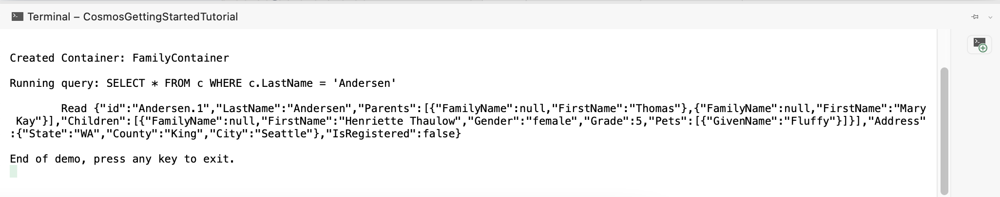

# Explanation

All deployed source codes are available in the directory (some hardcoded secrets removed).
Screenshot from Azure portal / finished tutorials checkpoints provided below, also with some explanation!

# Lab 1 - App Deployment

Directory `lab-01-app` contains last version of application (after keyvault lab).

# Lab 2 - AzureSQL and WebJobs

Here I modified my WebJob logic -- it's not sending emails, only writes out to console.
Code in directory.

# Lab 3 - Blob Storage and Configurations

# Lab 4 - Cosmos DB

Following the guide, I created items (all steps until Step 6):

Looking at my Cosmos DB instance:

Step 7 running query:

Replacing an item (console output):

Deleting an item (console output):

# Lab 5 - App Insights

Configuring Application Insights from Visual Studio 2022:

Exploring freshly configured Application Insights:

# Lab 6 - Managed Identity and KeyVault

## Managed Identity

I extended application from the first lab, `lab-01-app` directory contains deployed application using Azure.Identity!

## KeyVault

Testing Azure Identity on console app deployed as WebJob, setting Application Service access rights: 

KeyVault data:

Output from console app (Console app code in repo)

Testing access to KeyVault secret from WebApp using `configuration[]`:

Secret is printed -- only for quick demonstration purposes ;)

# Lab 7 - Serverless

## Event Hub

Request metrics:

)

## Logic Apps

My configuration for the Twitter 'hook':

I got an email!

Reviewing result:

## Zodiac

Running application locally:

Testing the function in Azure:

# Lab 8 - Cognitive Services

## Image Analysis

This image (TUM Munich, Fakultat fur Informatik, Rechnerhalle):

Service log:

Debug output:

## OCR

This image (Liquid Soap):

Debug output:

## FaceDetection

Me:

Debug output -- it tells me I'm older D:

